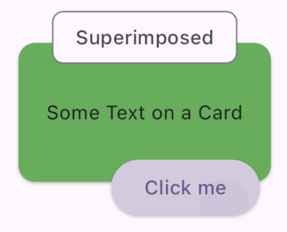
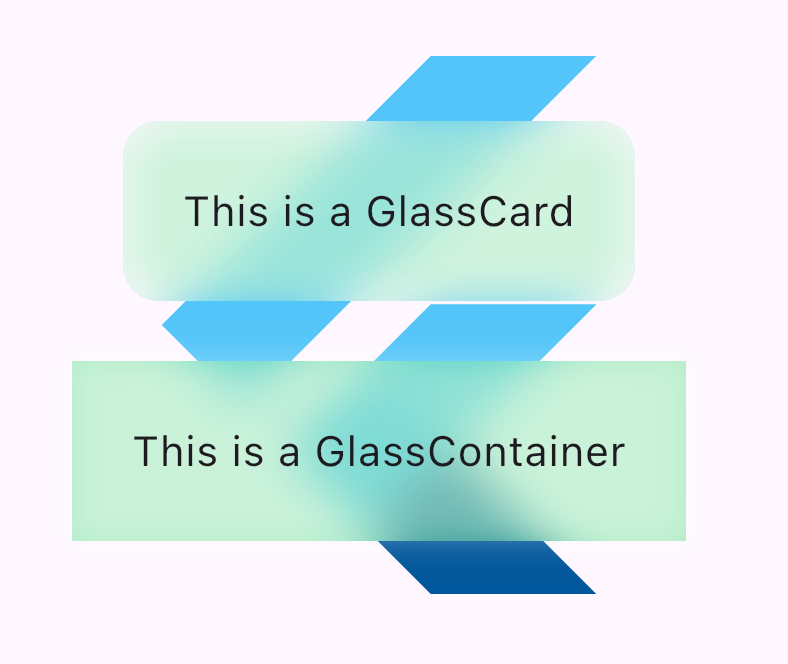
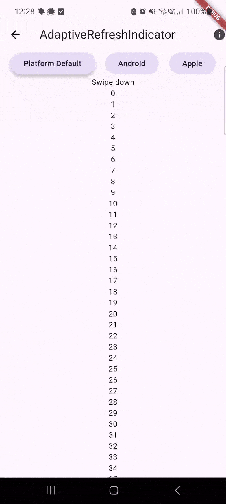

<!--
This README describes the package. If you publish this package to pub.dev,
this README's contents appear on the landing page for your package.

For information about how to write a good package README, see the guide for
[writing package pages](https://dart.dev/guides/libraries/writing-package-pages).

For general information about developing packages, see the Dart guide for
[creating packages](https://dart.dev/guides/libraries/create-library-packages)
and the Flutter guide for
[developing packages and plugins](https://flutter.dev/developing-packages).
-->

This package bundles small Widgets that are generally useful in different Projects.
Bloating this package with a ton of Widgets is not the goal of this package.
All Widgets in this library are either considered useful (if not mandatory) to be used in any project 
or allow advantages that are otherwise tedious to re-implement.

## Intro

I recommend to take a look at the [Example project](https://uximprovements.memeozer.com/) to see the most (if not all) features in action.


## Features

- FakeloadingWidget (introduce a min delay for non-async operations in the UI)
- SmoothFutureBuilder (introduce a min delay for async operations in the UI)
- Shimmer (a synchronized Shimmer effect above multiple widgets)
- ScreenshotBoundary (take screenshots without using the [screenshot](https://pub.dev/packages/screenshot) package)
- ImplicitAnimatedIcon (use AnimatedIcons without dealing with the AnimationController)
- PreloadedImage (Ink splashes and decorations clipped to not-yet loaded Image)
- AdaptiveRefreshIndicator (feels more native then RefreshIndicator.adaptive)
- SuperimposeBox (similar to Flutters Badge but allows aligning widgets easier together)
- EndlessListView (builds Widgets in both directions)
- UnboundStack (like Stack, but allows hit-testing (e.g. clicking, hovering, ...) Widgets outside of its bounds)
- GlassCard / GlassContainer (Glassmorphism effect)
- WarnBeforeUnload (WebOnly - Warns the user before unloading or refreshing the page takes effect)
- OverflowText (Overflow aware text, allows to shrink text widgets that can expand to show more text)
- Re-Exports [responsive_ux](https://pub.dev/packages/responsive_ux) 

## Getting started

```terminal
dart pub add ux_improvements
```

## Example Images

SuperimposeBox:


Glassmorphism:


AdaptiveRefreshIndicator:

## Usage

If the documentation lacks some points, open an issue and i will improve it.

## Additional information

I am open for contributions and ideas to improve (but not bloat) this package. Feel free to reach out.

This package is under active development.